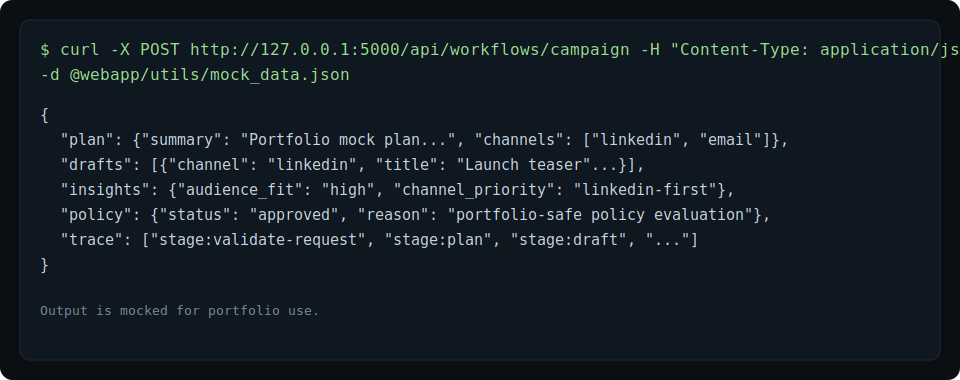

# Aigos Core (Portfolio)



This repository is a public, sanitized portfolio version of the Aigos system. It preserves the architecture and boundaries (routes -> services -> workflows -> integrations -> models) while replacing proprietary logic with clearly labeled mock implementations.

See `PORTFOLIO_SCOPE.md` for scope details.

## What This Repository Represents

This repository is a **portfolio-safe core implementation** inspired by a larger production system (AIGOS).

It demonstrates:
- Service-layer architecture
- Workflow-driven AI processing
- Clear separation of concerns
- Extensible, modular design

Certain production concerns (multi-tenancy, background workers, vendor integrations, security hardening) are intentionally omitted or simplified.

## Quick Demo

```bash
curl -X POST http://127.0.0.1:5000/api/workflows/campaign \
  -H "Content-Type: application/json" \
  -d @webapp/utils/mock_data.json
```

## Portfolio Highlights

- Clean architecture with explicit domain + pipeline stages
- Dependency injection for provider wiring and testability
- Mocked policy guardrails and analytics to show production shape
- Lightweight tests covering workflow and API boundaries

## Problem Aigos Solves

Aigos automates multi-channel content planning and publishing for small teams. It turns a campaign brief into a structured plan, drafts, and scheduling artifacts while maintaining quality controls and analytics feedback loops.

## System Architecture (Inputs -> Processing -> Outputs)

Inputs
- Campaign brief (audience, channel mix, goals, tone)
- Asset references (optional)

Processing
- Workflow orchestration
- Mock AI generation (example prompts only)
- Analytics enrichment (mock signals)
- Storage of artifacts (in-memory mock)

Outputs
- Campaign plan
- Draft content objects
- Audit-ready trace of decisions (mocked metadata)

High-level flow (portfolio-safe):

```
Client Request
   |
Routes (validation + request shaping)
   |
Workflow Orchestrator
   |
Pipeline Stages
  - Validate -> Plan -> Draft -> Policy -> Insights -> Persist
   |
Response (plan + drafts + trace)
```

## Module Responsibilities

- `webapp/routes`: Request handlers delegate responsibility to service-layer components, keeping business logic isolated and testable
- `webapp/services`: Business-facing services (content, analytics, policy, storage)
- `webapp/workflows`: Orchestration of multi-step processes
- `webapp/integrations`: External provider interfaces (mocked)
- `webapp/models`: Data schemas
- `webapp/prompts`: Example prompts (non-production)
- `webapp/domain`: Interfaces, validators, and pipeline primitives
- `webapp/container.py`: Dependency injection for provider wiring

## Design Principles

- Clear separation between orchestration and execution
- Explicit data flow through each stage of a workflow
- Minimized coupling between services
- Predictable, testable behavior
- Designed for extension rather than modification

## Running Locally (Mocked Only)

```bash
python -m venv .venv
# Windows (PowerShell)
.venv\Scripts\Activate.ps1
# macOS/Linux
source .venv/bin/activate

pip install -r requirements.txt
python app.py
```

Example response (truncated):

```json
{
  "plan": {
    "summary": "Portfolio mock plan for product leaders at SaaS startups across linkedin, email.",
    "channels": ["linkedin", "email"],
    "key_messages": ["Highlight primary value proposition.", "Include a concise CTA.", "Reinforce social proof where relevant."]
  },
  "drafts": [
    {"channel": "linkedin", "title": "Launch teaser", "body": "Example output: Draft a short LinkedIn post introducing a new product."},
    {"channel": "email", "title": "Customer follow-up", "body": "Example output: Draft a follow-up email summarizing benefits."}
  ],
  "insights": {"audience_fit": "high", "channel_priority": "linkedin-first", "risk_flag": "none"},
  "policy": {"status": "approved", "reason": "portfolio-safe policy evaluation (mocked)"},
  "prompt_example": "Example prompt (portfolio-safe): Generate a concise campaign outline for product leaders at SaaS startups across linkedin, email with the goal of drive demo requests and tone direct and value-focused.",
  "trace": ["stage:validate-request", "stage:plan", "stage:draft", "prompt-example:stored", "stage:policy", "stage:insights", "stage:persist", "storage:stored-mock"]
}
```

## Feature Flags (Mocked)

The portfolio version uses simple feature flags to show optional stages:
- `ENABLE_INSIGHTS`
- `ENABLE_PERSISTENCE`

See `webapp/config/feature_flags.py` for defaults.

## API Surface

- `GET /api/health` -> health check
- `GET /api/insights/overview` -> mocked analytics overview
- `GET /api/docs` -> portfolio-safe API listing
- `POST /api/workflows/campaign` -> run mocked workflow

## Testing

```bash
pip install -r requirements-dev.txt
pytest
```

## Production Considerations (High-Level)

In a full production environment, this system would typically include:
- Tenant-aware request handling and data isolation
- Background task execution for long-running jobs
- Environment-based configuration
- Structured health and diagnostics endpoints
- Automated testing and CI checks

These elements are outside the scope of this portfolio repository but inform its structure.

## Extending This in Production

In production, mocked services would be replaced by:
- A real LLM provider with prompt versioning and safety policies
- Persistent storage (database + object store)
- Job queue for long-running workflows
- Observability pipelines (metrics, tracing, alerting)
- Policy enforcement for compliance and brand safety

## What Is Intentionally Omitted

- Proprietary automation logic, business rules, and prompts
- Production integrations, credentials, and configs
- Customer data and real datasets
- Deployment workflows and operational runbooks

See `DISCLAIMER.md` for additional details.

## Portfolio Notes

This repository is intentionally curated for public review. It emphasizes architecture, testability, and clean boundaries while keeping all implementations mock-only and non-proprietary.
