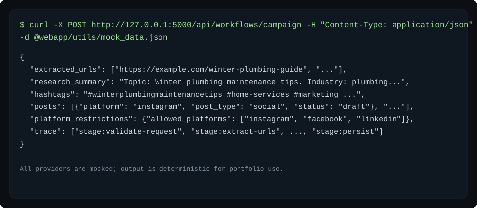

# AIGOS (Content Autopilot) - Core Portfolio



This repository is a public, sanitized portfolio version of the AIGOS platform. It preserves the architecture and boundaries (routes -> services -> workflows -> integrations -> models) while replacing proprietary logic with clearly labeled mock implementations.

See `PORTFOLIO_SCOPE.md` for scope details and `DISCLAIMER.md` for the intellectual property notice.

---

## 1. System Overview

AIGOS is a multi-tenant SaaS platform built for AI-powered social media content generation, business research, and contractor/trades operations. The platform is designed to serve agencies managing multiple clients, providing a suite of tools for automation, lead generation, and business management.

This repository demonstrates the **portfolio-safe core** of the platform, used as the reference implementation for the whole system. Certain production concerns (multi-tenancy, background workers, vendor integrations) are intentionally mocked or simplified.

## 2. Technology Stack (Production System)

While this repository contains a mocked version, the full production system leverages:
- **Language:** Python 3.12
- **Web Framework:** Flask 3.0, Gunicorn
- **Database:** PostgreSQL 15 (via SQLAlchemy 2.0 ORM)
- **Async/Background Tasks:** Celery 5.3 + Redis 7 (broker, result backend, and cache)
- **Serverless Integration:** AWS Lambda
- **AI Integrations:** OpenAI (GPT-4o, DALL·E 3), AWS Bedrock (Stable Diffusion 3.5 Large, Gemma 3 12B), Vision Analysis
- **Voice/Video integrations:** ElevenLabs, Google TTS, Azure Speech, D-ID, Synthesia, HeyGen
- **Payments:** Stripe (subscriptions and marketplace)
- **Email/SMS:** SendGrid, Telnyx
- **Storage:** AWS S3
- **Social Media APIs:** Meta (Facebook/Instagram), LinkedIn, Twitter/X, Reddit
- **Infrastructure:** Docker, Docker Compose, AWS EC2

## 3. Core Architecture (Production System)

### Multi-Tenancy
The platform relies on a strict multi-tenant architecture to isolate data between different agencies/organizations.
- **Tenant Resolution:** Determined dynamically via subdomain, custom domain, or session fallback.
- **Data Isolation:** All major data models include a `tenant_id` foreign key. Database queries are filtered at the application level to ensure data is strictly scoped to the active tenant.
- **Middleware:** A middleware stack intercepts requests to resolve the tenant, enforce legal compliance (e.g., consent tracking), manage session timeouts, and gate features based on active subscriptions.

### Async Processing (Celery)
Given the heavy reliance on external AI APIs and scheduled social media posting, Celery is used extensively for asynchronous processing.
- **Priority Queues:** Tasks are routed to specific queues (e.g., email, media generation, research, cleanup) to ensure critical tasks are not blocked by long-running background jobs.
- **Beat Scheduler:** A cron-like scheduler triggers automated workflows, such as lead discovery, metrics aggregation, and daily cleanups.

### Serverless AI Generation (AWS Lambda)
To offload heavy generative AI workloads, the platform integrates with AWS Lambda and AWS Bedrock:
- **Image Generation:** Uses Stable Diffusion 3.5 Large (`stability.sd3-5-large-v1:0`) to create high-quality, professional commercial photography based on business profiles.
- **Content Generation:** Uses Google Gemma 3 12B (`google.gemma-3-12b-it`) to create structured, JSON-formatted ad copy.
- **Execution:** The Lambda function is triggered via API to return both base64-encoded images and structured marketing copy synchronously.

## 4. Security & SOC 2 Compliance Readiness

The platform is designed with enterprise-grade security controls and built-in SOC 2 compliance capabilities, critical for operating safely as a B2B SaaS platform.

- **Audit Logging:** Comprehensive tracking of user actions, API usage, and administrative overrides (`ActivityLog`, `ComplianceAuditLog`, and `ImpersonationLog`).
- **Session & Access Control:** Hardened authentication with Two-Factor Auth (TOTP), login throttling, password policies, and strict 8-hour idle session timeouts.
- **Consent & Legal Tracking:** Immutable records of `UserConsent` and `DataProcessingConsent` alongside automated legal document versioning.
- **Infrastructure Security:** Uses non-root Docker execution environments, strict HTTP security headers (HSTS, X-Frame-Options), and field-level encryption for sensitive data (e.g., social media tokens).

## 5. The 6 Planet Hubs

AIGOS gives small teams an integrated growth platform built on one shared core. Each product is a self-contained **planet hub**.

| Hub | Description | Focus Areas |
| --- | --- | --- |
| **ContentPilot** | AI-powered content creation & social media automation. | Multi-platform scheduling, AI generation, campaign approvals. |
| **LeadEngine** | AI-powered lead discovery, outreach & proposals. | Automated outreach, competitor research, AI proposals. |
| **TradeHub** | CRM built for contractors & trade businesses. | Estimates, invoices, permit tracking, work orders. |
| **AvatarStudio** | AI avatars, video generation & voice synthesis. | Video avatars, voice fusion, email-to-video automation. |
| **PlaybookOS** | Playbooks, LMS & marketplace for growth strategies. | Course building, proven marketing playbooks, certifications. |
| **AutoFlow** | Email automation, workflows & AI chat assistant. | Multi-step workflows, trigger emails, chat assistants. |

*(The slice demonstrated in this runnable repository is ContentPilot's core.)*

## 6. Portfolio Highlights & Design Principles

This repository demonstrates:
- **Service-layer architecture:** Business-facing services (`webapp/services`) handle logic, keeping `webapp/routes` clean.
- **Workflow-driven AI processing:** Explicit multi-step orchestrators in `webapp/workflows`.
- **Dependency injection:** Found in `webapp/container.py` for provider wiring and testability.
- **Clear separation of concerns:** Explicit data flow through each stage (Validate -> Plan -> Draft -> Policy -> Insights -> Persist).
- **Extensible, modular design:** Designed for extension rather than modification.

## 7. Directory Structure Overview

```text
├── webapp/                      # The core Flask application
│   ├── __init__.py              # App factory, blueprint registration, middleware
│   ├── config.py                # Environment configurations
│   ├── models/                  # SQLAlchemy models (Data layer)
│   ├── routes/                  # Flask Blueprints (HTTP layer)
│   ├── services/                # Business logic and external API integrations
│   ├── workflows/               # Orchestration of multi-step processes
│   ├── domain/                  # Interfaces, validators, and pipeline primitives
│   ├── integrations/            # External provider interfaces (mocked)
│   ├── prompts/                 # Example prompts (non-production)
│   ├── container.py             # Dependency injection
│   └── utils/                   # Shared utilities and mock data
├── tests/                       # Comprehensive Pytest suite
└── docker-compose.yml           # Local development and container orchestration
```

## 8. Quick Demo (Mocked)

```bash
curl -X POST http://127.0.0.1:5000/api/workflows/campaign \
  -H "Content-Type: application/json" \
  -d @webapp/utils/mock_data.json
```

**Example response (truncated):**
```json
{
  "plan": {
    "summary": "Portfolio mock plan for product leaders at SaaS startups...",
    "channels": ["linkedin", "email"]
  },
  "drafts": [
    {"channel": "linkedin", "title": "Launch teaser", "body": "Example output..."}
  ],
  "insights": {"audience_fit": "high", "channel_priority": "linkedin-first", "risk_flag": "none"},
  "policy": {"status": "approved", "reason": "portfolio-safe policy evaluation (mocked)"},
  "trace": ["stage:validate-request", "stage:plan", "stage:draft", "stage:policy", "stage:insights", "stage:persist"]
}
```

## 9. Running Locally

```bash
python -m venv .venv
# Windows (PowerShell)
.venv\Scripts\Activate.ps1
# macOS/Linux
source .venv/bin/activate

pip install -r requirements.txt
python app.py
```

### Testing
```bash
pip install -r requirements-dev.txt
pytest
```

## 10. Feature Flags (Mocked)

The portfolio version uses simple feature flags to show optional stages:
- `ENABLE_INSIGHTS`
- `ENABLE_PERSISTENCE`

See `webapp/config/feature_flags.py` for defaults.

## 11. API Surface

- `GET /api/health` -> health check
- `GET /api/insights/overview` -> mocked analytics overview
- `GET /api/docs` -> portfolio-safe API listing
- `POST /api/workflows/campaign` -> run mocked workflow

## 12. What Is Intentionally Omitted

- Proprietary automation logic, business rules, and prompts
- Production integrations, credentials, and configs
- Customer data and real datasets
- Deployment workflows and operational runbooks

---
*Note: This repository is intentionally curated for public review. It emphasizes architecture, testability, and clean boundaries while keeping all implementations mock-only and non-proprietary.*
